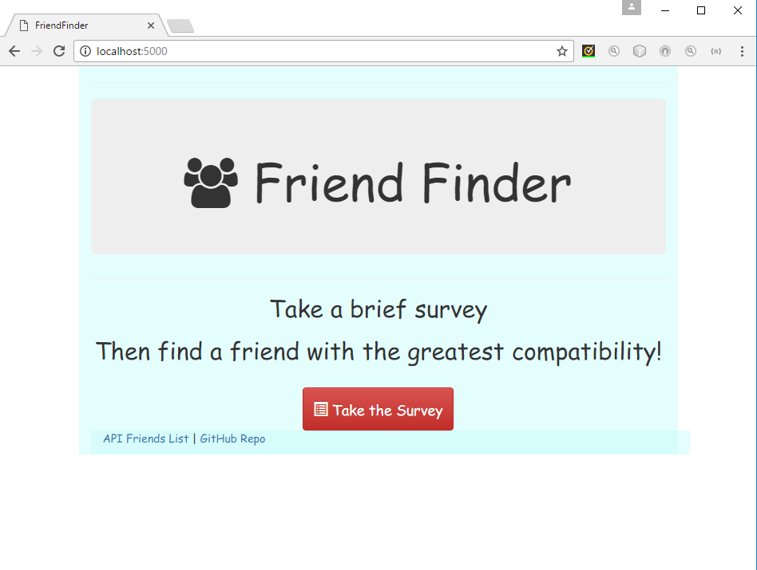
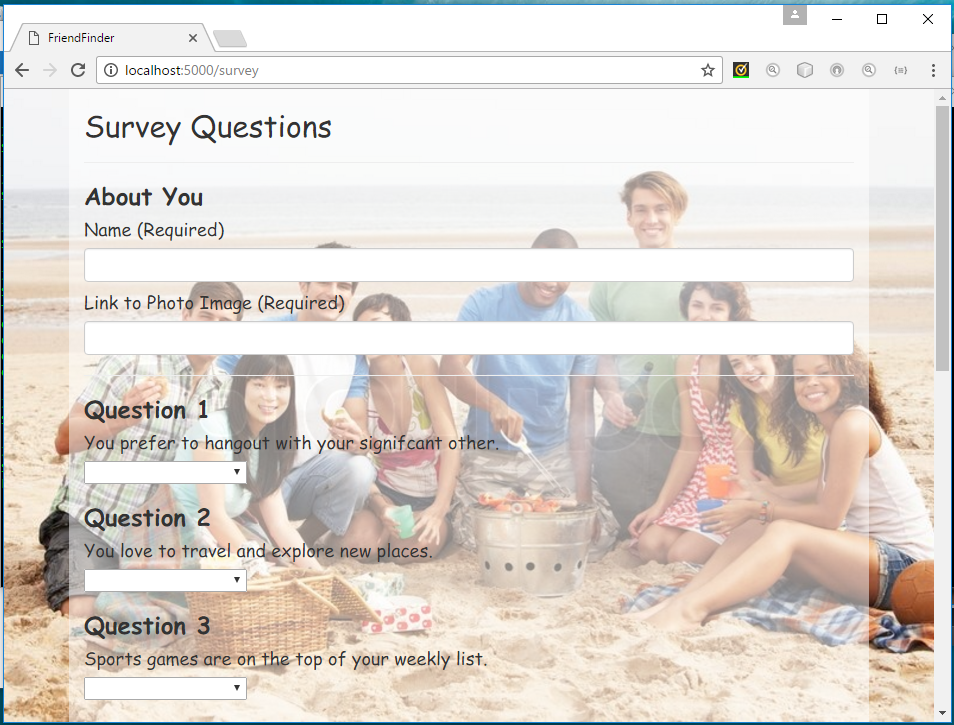

# Friend Finder - Node and Express Servers

### Overview Overview

In this activity, you'll build a compatibility-based "FriendFinder" application -- basically a dating app. This full-stack site will take in results your users' surveys, then compare their answers with those from other users. The app will then display the name and picture of the user with the best overall match.

